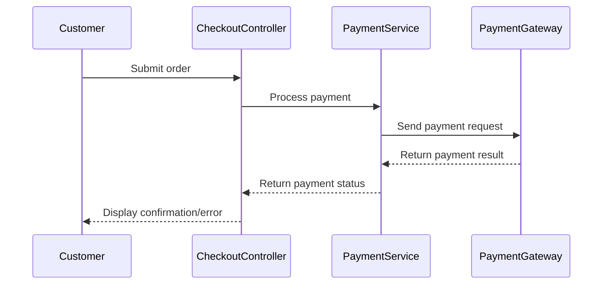

# Payment Gateway Integrations

## Overview

The Reina.MacCredy E-Commerce Platform integrates with multiple payment gateways to provide customers with various payment options. This document outlines the payment integrations, their implementation details, and best practices for handling payment processing.

## Supported Payment Methods

The application supports the following payment methods:

1. **MoMo**: Mobile wallet payment service
2. **VNPay**: Vietnam Payment Solution
3. **Cash on Delivery**: Physical cash payment upon delivery
4. **Credit Card**: Direct credit card processing

## Integration Architecture

The payment processing follows a service-based architecture:



## Implementation Details

### Payment Service

The `PaymentService` class handles the interaction with external payment gateways:

```csharp
public class PaymentService : IPaymentService
{
    private readonly IHttpClientFactory _httpClientFactory;
    private readonly ILogger<PaymentService> _logger;
    
    public PaymentService(IHttpClientFactory httpClientFactory, ILogger<PaymentService> logger)
    {
        _httpClientFactory = httpClientFactory;
        _logger = logger;
    }
    
    public async Task<PaymentResult> ProcessMoMoPaymentAsync(Order order, string returnUrl)
    {
        try
        {
            // Create HTTP client with proper timeout
            var client = _httpClientFactory.CreateClient("MoMoClient");
            client.Timeout = TimeSpan.FromSeconds(30);
            
            // Prepare request payload
            var requestData = new
            {
                PartnerCode = "MOMO_PARTNER_CODE",
                AccessKey = "MOMO_ACCESS_KEY",
                RequestId = Guid.NewGuid().ToString(),
                Amount = (int)order.TotalAmount,
                OrderId = order.Id.ToString(),
                OrderInfo = $"Payment for order #{order.Id}",
                ReturnUrl = returnUrl,
                NotifyUrl = "https://yourdomain.com/api/payment/momo-notify",
                ExtraData = "",
                RequestType = "captureMoMoWallet",
                Signature = CreateMoMoSignature(/* parameters */)
            };
            
            // Send request to MoMo API
            var response = await client.PostAsJsonAsync("https://test-payment.momo.vn/gw_payment/transactionProcessor", requestData);
            response.EnsureSuccessStatusCode();
            
            // Process response
            var responseData = await response.Content.ReadFromJsonAsync<MoMoResponse>();
            
            if (responseData?.ResultCode == 0)
            {
                return new PaymentResult
                {
                    Success = true,
                    RedirectUrl = responseData.PayUrl,
                    TransactionId = responseData.TransactionId
                };
            }
            
            _logger.LogWarning("MoMo payment failed: {ErrorCode} - {ErrorMessage}", 
                responseData?.ResultCode, responseData?.Message);
            
            return new PaymentResult
            {
                Success = false,
                ErrorMessage = responseData?.Message ?? "Payment processing failed"
            };
        }
        catch (HttpRequestException ex)
        {
            _logger.LogError(ex, "HTTP request error during MoMo payment processing");
            return new PaymentResult
            {
                Success = false,
                ErrorMessage = "Unable to connect to payment service. Please try again later."
            };
        }
        catch (TaskCanceledException ex)
        {
            _logger.LogError(ex, "Timeout occurred during MoMo payment processing");
            return new PaymentResult
            {
                Success = false,
                ErrorMessage = "Payment request timed out. Please try again later."
            };
        }
        catch (Exception ex)
        {
            _logger.LogError(ex, "Unexpected error during MoMo payment processing");
            return new PaymentResult
            {
                Success = false,
                ErrorMessage = "An unexpected error occurred. Please try again later."
            };
        }
    }
    
    // Similar methods for VNPay and other payment gateways
}
```

### Payment Controller

The `PaymentController` handles payment requests and callbacks:

```csharp
[Route("api/[controller]")]
public class PaymentController : Controller
{
    private readonly IPaymentService _paymentService;
    private readonly IOrderRepository _orderRepository;
    private readonly ILogger<PaymentController> _logger;
    
    public PaymentController(
        IPaymentService paymentService,
        IOrderRepository orderRepository,
        ILogger<PaymentController> logger)
    {
        _paymentService = paymentService;
        _orderRepository = orderRepository;
        _logger = logger;
    }
    
    [HttpPost("process")]
    public async Task<IActionResult> ProcessPayment(int orderId, string paymentMethod)
    {
        try
        {
            var order = await _orderRepository.GetByIdAsync(orderId);
            if (order == null)
            {
                return NotFound("Order not found");
            }
            
            // Generate return URL
            var returnUrl = Url.Action("PaymentCallback", "Payment", null, Request.Scheme);
            
            PaymentResult result;
            switch (paymentMethod.ToLower())
            {
                case "momo":
                    result = await _paymentService.ProcessMoMoPaymentAsync(order, returnUrl);
                    break;
                case "vnpay":
                    result = await _paymentService.ProcessVNPayPaymentAsync(order, returnUrl);
                    break;
                case "cod":
                    // For COD, no external payment processing needed
                    result = new PaymentResult
                    {
                        Success = true,
                        RedirectUrl = Url.Action("Confirmation", "Order", new { orderId = order.Id })
                    };
                    break;
                default:
                    return BadRequest("Unsupported payment method");
            }
            
            if (result.Success)
            {
                return Json(new { success = true, redirectUrl = result.RedirectUrl });
            }
            
            return Json(new { success = false, errorMessage = result.ErrorMessage });
        }
        catch (Exception ex)
        {
            _logger.LogError(ex, "Error processing payment for order {OrderId}", orderId);
            return StatusCode(500, "An error occurred while processing your payment");
        }
    }
    
    [HttpGet("momo-callback")]
    public async Task<IActionResult> MoMoCallback([FromQuery] MoMoCallbackModel callbackData)
    {
        try
        {
            // Verify callback signature
            // Update order status
            // Redirect to confirmation page
        }
        catch (Exception ex)
        {
            _logger.LogError(ex, "Error processing MoMo callback");
            return RedirectToAction("Error", "Home");
        }
    }
    
    // Similar methods for VNPay callback
}
```

## Error Handling

The payment integration implements robust error handling:

1. **HTTP Request Errors**: Proper handling of connection issues
2. **Timeout Handling**: Configuration to prevent hanging requests
3. **Response Validation**: Thorough checking of gateway responses
4. **User-Friendly Messages**: Clear error messages for customers
5. **Detailed Logging**: Comprehensive logging throughout the payment flow

## Security Considerations

1. **HTTPS**: All payment communication uses secure HTTPS
2. **Signature Validation**: Request and response signatures are verified
3. **Timeout Configuration**: Prevents hanging connections
4. **Error Masking**: Internal errors are not exposed to users
5. **PCI Compliance**: Credit card details are not stored on the server
6. **CSRF Protection**: Anti-forgery tokens for payment forms

## Testing Payment Integration

The payment integration can be tested in sandbox/development environments:

1. **MoMo Sandbox**:
   - URL: https://test-payment.momo.vn
   - Test account: Available in development environment variables

2. **VNPay Sandbox**:
   - URL: https://sandbox.vnpayment.vn
   - Test accounts: Available in development documentation

## Common Issues and Solutions

1. **Gateway Timeout**
   - **Issue**: Payment gateway not responding within expected time
   - **Solution**: Implemented proper timeout configuration (30 seconds) and retry logic

2. **Invalid Signature**
   - **Issue**: Payment request signature validation fails
   - **Solution**: Ensured consistent parameter ordering and encoding in signature creation

3. **Session Expiration**
   - **Issue**: User session expires during payment process
   - **Solution**: Implemented order tracking by ID independent of session state

4. **Payment Callback Handling**
   - **Issue**: Payment gateway callback not properly processed
   - **Solution**: Added comprehensive logging and error handling for callback endpoints

## Payment Flow Sequence

1. User submits order for checkout
2. System presents payment method options
3. User selects payment method
4. System initiates payment request with the gateway
5. User is redirected to payment gateway (if necessary)
6. Payment gateway processes payment and returns result
7. System receives callback from payment gateway
8. Order status is updated based on payment result
9. User is shown confirmation or error message 