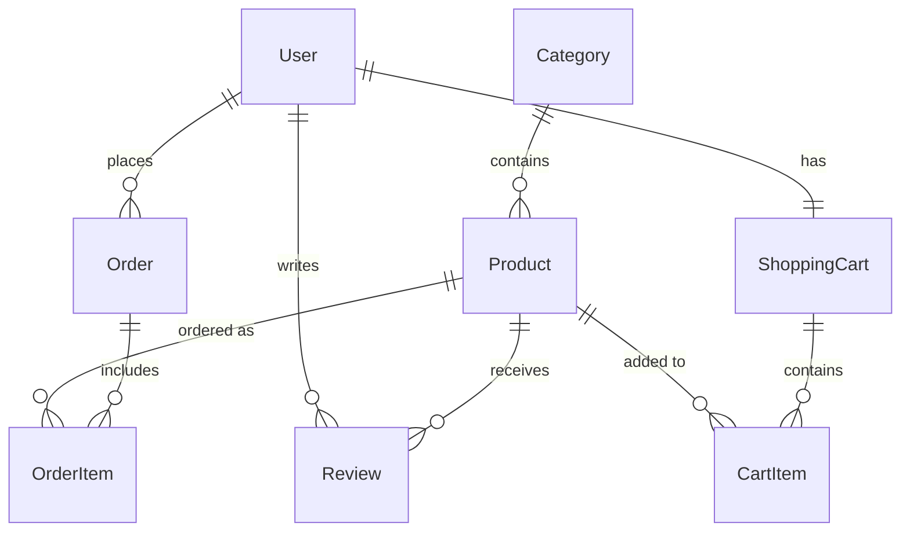

# Data Model

## Overview

The Reina.MacCredy E-Commerce Platform uses a relational database model managed through Entity Framework Core. The data model represents the core entities needed for an e-commerce system, with a focus on a coffee shop implementation.

## Core Entities

### User

Represents a customer or administrator in the system.

- **Id**: Unique identifier
- **UserName**: User's login name
- **Email**: User's email address
- **PasswordHash**: Securely stored password
- **FirstName**: User's first name
- **LastName**: User's last name
- **PhoneNumber**: Contact phone number
- **Address**: Shipping address
- **Role**: User role (Customer, Admin)
- **ProfileImagePath**: Path to profile picture

### Product

Represents a coffee product or merchandise item.

- **Id**: Unique identifier
- **Name**: Product name
- **Description**: Detailed product description
- **Price**: Base price
- **ImageUrl**: Product image path
- **CategoryId**: Foreign key to Category
- **IsAvailable**: Availability status
- **IsFeatured**: Whether product is featured on home page
- **PreparationTime**: Time required to prepare (for coffee items)
- **Sizes**: Available size options
- **Customizations**: Available customizations (flavors, extras)

### Category

Organizes products into logical groups.

- **Id**: Unique identifier
- **Name**: Category name
- **Description**: Category description
- **ImageUrl**: Category image path
- **Products**: Navigation property to Products

### Order

Represents a customer purchase.

- **Id**: Unique identifier
- **UserId**: Customer who placed the order
- **OrderDate**: Date and time of order
- **TotalAmount**: Total order cost
- **OrderStatus**: Status (Pending, Processing, Shipped, Delivered, Cancelled)
- **PaymentStatus**: Payment status (Pending, Completed, Failed)
- **PaymentMethod**: Method used (Cash, Credit Card, MoMo, VNPay)
- **ShippingAddress**: Delivery address
- **OrderItems**: Collection of OrderItem entities

### OrderItem

Represents an individual product in an order.

- **Id**: Unique identifier
- **OrderId**: Foreign key to Order
- **ProductId**: Foreign key to Product
- **Quantity**: Number of items
- **UnitPrice**: Price at time of purchase
- **Size**: Selected size
- **Customizations**: Selected customizations

### Review

Customer feedback for products.

- **Id**: Unique identifier
- **ProductId**: Foreign key to Product
- **UserId**: Foreign key to User
- **Rating**: Numerical rating (1-5)
- **Comment**: Review text
- **ReviewDate**: Date and time of review

### ShoppingCart

Represents a user's shopping cart.

- **Id**: Unique identifier
- **UserId**: User who owns the cart
- **CreatedDate**: When the cart was created
- **CartItems**: Collection of CartItem entities
- **TotalPrice**: Calculated total price of items

### CartItem

Individual item in a shopping cart.

- **Id**: Unique identifier
- **CartId**: Foreign key to ShoppingCart
- **ProductId**: Foreign key to Product
- **Quantity**: Number of items
- **Size**: Selected size
- **Customizations**: Selected customizations

## Relationships

1. **User to Order**: One-to-Many (A user can have multiple orders)
2. **User to Review**: One-to-Many (A user can write multiple reviews)
3. **Category to Product**: One-to-Many (A category can contain multiple products)
4. **Product to Review**: One-to-Many (A product can have multiple reviews)
5. **Order to OrderItem**: One-to-Many (An order consists of multiple order items)
6. **User to ShoppingCart**: One-to-One (A user has one shopping cart)
7. **ShoppingCart to CartItem**: One-to-Many (A shopping cart contains multiple items)

## Database Diagram

## Data Access Pattern

The application uses the Repository pattern to abstract data access:

1. **Entity Model**: Represents the database structure
2. **Repository Interfaces**: Define data access contracts (IProductRepository, IOrderRepository)
3. **Repository Implementations**: Concrete implementations using Entity Framework Core
4. **Unit of Work**: Coordinates operations across multiple repositories

This pattern ensures:
- Separation of concerns
- Testability through dependency injection
- Consistent data access patterns
- Flexibility to change data access implementation 