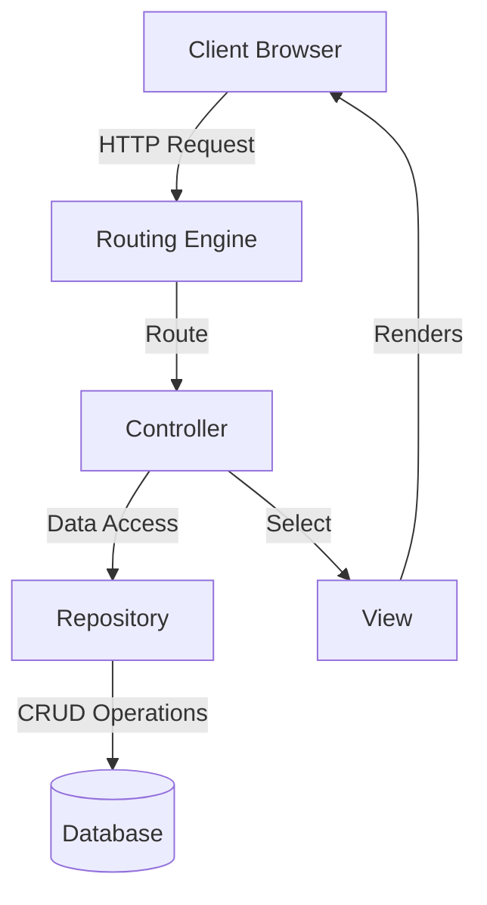
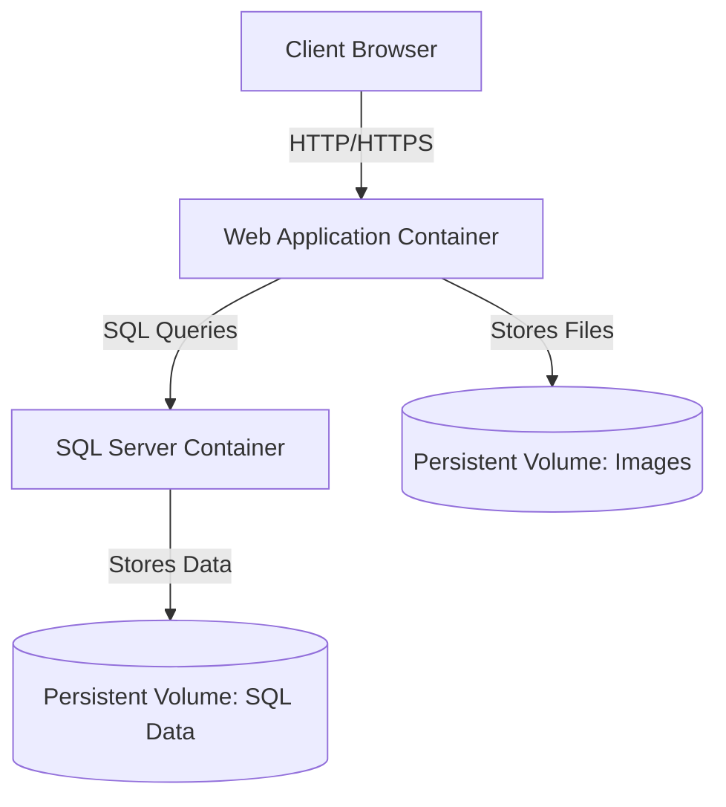

# Architecture Overview

## Design Philosophy

The Reina.MacCredy E-Commerce Platform follows a structured architectural approach with clear separation of concerns. The project utilizes industry-standard patterns and practices to ensure maintainability, scalability, and security.

## Architecture Layers

The application is built with a layered architecture:

1. **Presentation Layer**: MVC Controllers and Razor Views
2. **Service Layer**: Business logic services
3. **Repository Layer**: Data access abstraction
4. **Data Layer**: Entity Framework Core and SQL Server

## Core Architectural Patterns

### MVC (Model-View-Controller)

The application uses the ASP.NET Core MVC pattern:

- **Models**: Represent the data and business logic
- **Views**: Handle the UI presentation using Razor syntax
- **Controllers**: Process user input, update models, and select views



### Repository Pattern

Data access is abstracted through repositories:

- **Interfaces**: Define the contract for data access operations
- **Implementations**: Provide concrete implementations using Entity Framework Core
- **Dependency Injection**: Repositories are injected into controllers

```csharp
// Interface
public interface IProductRepository
{
    Task<IEnumerable<Product>> GetAllAsync();
    Task<Product> GetByIdAsync(int id);
    Task AddAsync(Product product);
    Task UpdateAsync(Product product);
    Task DeleteAsync(int id);
}

// Implementation
public class ProductRepository : IProductRepository
{
    private readonly ApplicationDbContext _context;

    public ProductRepository(ApplicationDbContext context)
    {
        _context = context;
    }

    public async Task<IEnumerable<Product>> GetAllAsync()
    {
        return await _context.Products
            .Include(p => p.Category)
            .ToListAsync();
    }

    // Other implementations...
}
```

### Dependency Injection

ASP.NET Core's built-in DI container is used to inject dependencies:

```csharp
// Registration in Program.cs
builder.Services.AddScoped<IProductRepository, ProductRepository>();
builder.Services.AddScoped<ICategoryRepository, CategoryRepository>();
builder.Services.AddScoped<IOrderRepository, OrderRepository>();
builder.Services.AddScoped<IPaymentService, PaymentService>();
```

## Client-Side Architecture

The front-end architecture follows these patterns:

- **Progressive Enhancement**: Core functionality works without JavaScript
- **Modular JavaScript**: Functionality organized in modules by feature
- **AJAX Interactions**: Dynamic updates without full page reloads
- **CSS Architecture**: Component-based styling with reusable patterns

## Database Schema

The database includes the following main entities:

- **Users**: Customer accounts with profile information
- **Products**: Coffee and food items with details and pricing
- **Categories**: Product categorization
- **Orders**: Customer orders with status tracking
- **OrderItems**: Individual items in an order
- **Reviews**: Product reviews from customers

## Container Architecture

The application is containerized using Docker with a multi-container approach:



### Container Configuration

Docker Compose is used to orchestrate multiple containers:

```yaml
# Key parts of docker-compose.yml
services:
  webapp:
    build:
      context: .
      dockerfile: Dockerfile
    environment:
      - ASPNETCORE_ENVIRONMENT=Production
      - ConnectionStrings__DefaultConnection=Server=sqlserver;Database=HomeBrew;...
    depends_on:
      - sqlserver
    networks:
      - reina-network
    volumes:
      - ./wwwroot/images:/app/wwwroot/images

  sqlserver:
    image: mcr.microsoft.com/mssql/server:2022-latest
    environment:
      - ACCEPT_EULA=Y
      - SA_PASSWORD=NewPassword123!
    volumes:
      - sqlserver-data:/var/opt/mssql
    networks:
      - reina-network

networks:
  reina-network:

volumes:
  sqlserver-data:
```

## Security Architecture

The application implements several security patterns:

1. **Authentication**: ASP.NET Core Identity for user authentication
2. **Authorization**: Role-based and policy-based authorization
3. **Data Protection**: ASP.NET Core Data Protection for secure storage
4. **Input Validation**: Server-side and client-side validation
5. **CSRF Protection**: Anti-forgery tokens for form submissions
6. **Secure Communication**: HTTPS for all transactions
7. **Secure Cookies**: HttpOnly and Secure cookies
8. **Error Handling**: Custom error pages and logging

## Performance Patterns

The application uses several patterns to optimize performance:

1. **Caching**: In-memory cache for frequently accessed data
2. **Query Optimization**: Efficient Entity Framework queries
3. **Asynchronous Operations**: Async/await pattern for I/O operations
4. **Resource Bundling**: CSS and JavaScript bundling for frontend optimization 