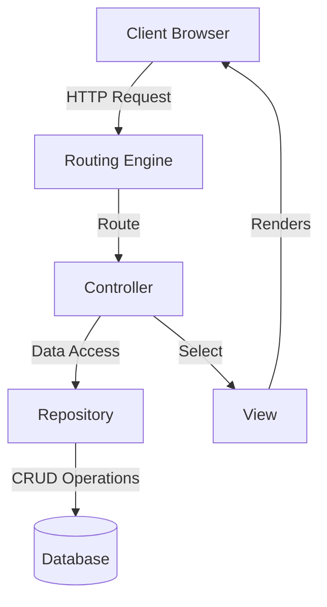
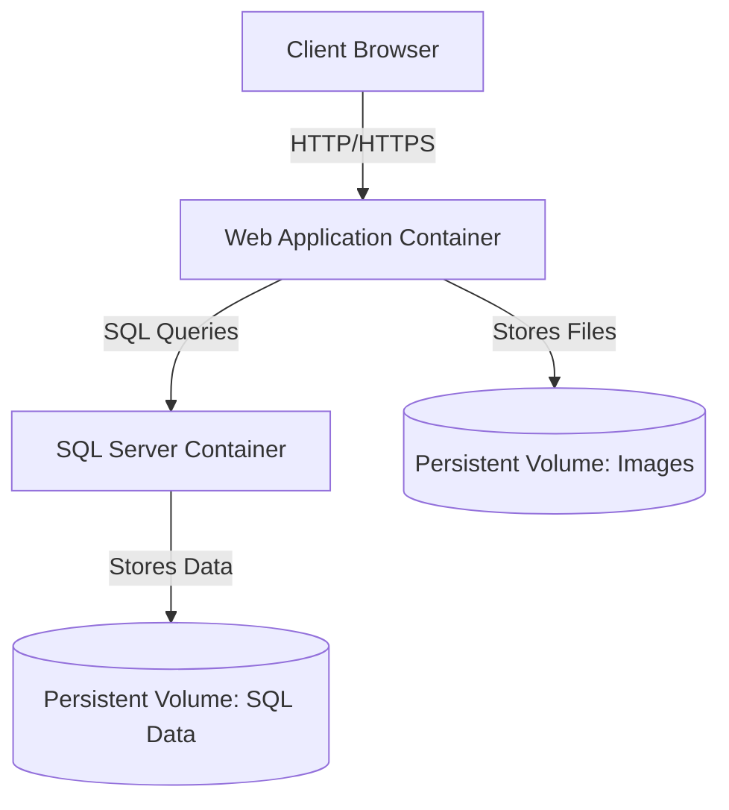

# System Patterns

## Architectural Design

The MVC Framework Demo project follows a layered architecture with clear separation of concerns. The main architectural patterns used are:

### MVC (Model-View-Controller)

The application uses the ASP.NET Core MVC pattern:

- **Models**: Represent the data and business logic
- **Views**: Handle the UI presentation using Razor syntax
- **Controllers**: Process user input, update models, and select views



### Repository Pattern

Data access is abstracted through repositories:

- **Interfaces**: Define the contract for data access operations
- **Implementations**: Provide concrete implementations using Entity Framework Core
- **Dependency Injection**: Repositories are injected into controllers

```csharp
// Interface
public interface IProductRepository
{
    Task<IEnumerable<Product>> GetAllAsync();
    Task<Product> GetByIdAsync(int id);
    Task AddAsync(Product product);
    Task UpdateAsync(Product product);
    Task DeleteAsync(int id);
}

// Implementation
public class ProductRepository : IProductRepository
{
    private readonly ApplicationDbContext _context;

    public ProductRepository(ApplicationDbContext context)
    {
        _context = context;
    }

    public async Task<IEnumerable<Product>> GetAllAsync()
    {
        return await _context.Products
            .Include(p => p.Category)
            .ToListAsync();
    }

    // Other implementations...
}
```

### Service Layer

Business logic is encapsulated in services:

- **Payment Service**: Handles payment gateway integration
- **Order Service**: Manages order processing
- **User Service**: Handles user-related operations

### Dependency Injection

ASP.NET Core's built-in DI container is used to inject dependencies:

```csharp
// Registration in Program.cs
builder.Services.AddScoped<IProductRepository, ProductRepository>();
builder.Services.AddScoped<ICategoryRepository, CategoryRepository>();
builder.Services.AddScoped<IOrderRepository, OrderRepository>();
builder.Services.AddScoped<IPaymentService, PaymentService>();

// Usage in a controller
public class ProductController : Controller
{
    private readonly IProductRepository _productRepository;

    public ProductController(IProductRepository productRepository)
    {
        _productRepository = productRepository;
    }

    // Action methods...
}
```

### Unit of Work

Multiple repository operations are coordinated through a unit of work pattern:

```csharp
public interface IUnitOfWork
{
    IProductRepository Products { get; }
    ICategoryRepository Categories { get; }
    IOrderRepository Orders { get; }
    
    Task CompleteAsync();
}
```

## Database Schema

The database includes the following main entities:

- **Users**: Customer accounts with profile information
- **Products**: Coffee and food items with details and pricing
- **Categories**: Product categorization
- **Orders**: Customer orders with status tracking
- **OrderItems**: Individual items in an order
- **Reviews**: Product reviews from customers

## Client-Side Architecture

The front-end architecture follows these patterns:

- **Progressive Enhancement**: Core functionality works without JavaScript
- **Modular JavaScript**: Functionality organized in modules by feature
- **AJAX Interactions**: Dynamic updates without full page reloads
- **CSS Architecture**: Component-based styling with reusable patterns

## Container Architecture

The application is containerized using Docker, following these patterns:

### Multi-Container Architecture

The application is split into separate containers for different services:

- **Web Application Container**: ASP.NET Core application
- **Database Container**: SQL Server for data storage



### Environment-Based Configuration

The application uses environment variables to configure behavior based on the running environment:

- **Database Provider Selection**: Automatically switches between SQLite (local) and SQL Server (Docker)
- **Connection String Configuration**: Uses environment-specific connection strings
- **Feature Toggles**: Enables/disables features based on environment

### Container Orchestration

Docker Compose is used to orchestrate multiple containers:

```yaml
# Key parts of docker-compose.yml
services:
  webapp:
    build:
      context: .
      dockerfile: Dockerfile
    environment:
      - ASPNETCORE_ENVIRONMENT=Production
      - ConnectionStrings__DefaultConnection=Server=sqlserver;Database=HomeBrew;...
    depends_on:
      - sqlserver
    networks:
      - reina-network
    volumes:
      - ./wwwroot/images:/app/wwwroot/images

  sqlserver:
    image: mcr.microsoft.com/mssql/server:2022-latest
    environment:
      - ACCEPT_EULA=Y
      - SA_PASSWORD=NewPassword123!
    volumes:
      - sqlserver-data:/var/opt/mssql
    networks:
      - reina-network

networks:
  reina-network:

volumes:
  sqlserver-data:
```

### Health Monitoring Pattern

Both containers implement health checks for monitoring and self-healing:

- **Web Application**: HTTP endpoint health check
- **Database**: Connection-based health check
- **Automatic Restart**: Containers restart automatically on failure

### Container Cleanup Strategy

The application implements a consistent cleanup strategy to prevent resource leakage:

- **Orphaned Container Removal**: `--remove-orphans` flag automatically cleans up orphaned containers
- **Consistent Naming**: Clear container naming convention for easier management
- **Proper Shutdown**: Graceful shutdown procedures to prevent data corruption

## Session Management

User state is managed through session storage:

- **Shopping Cart**: Stored in session for unauthenticated users
- **Preferences**: User preferences stored in session
- **Session Serialization**: JSON serialization for complex objects

## Event-driven Interactions

The application uses events for loosely coupled interactions:

- **Order Events**: Trigger notifications and status updates
- **Payment Events**: Handle payment processing status changes

## Security Patterns

Security is implemented through several patterns:

- **Authentication**: ASP.NET Core Identity for user authentication
- **Authorization**: Role-based and policy-based authorization
- **Data Protection**: ASP.NET Core Data Protection for secure storage
- **Input Validation**: Server-side and client-side validation
- **CSRF Protection**: Anti-forgery tokens for form submissions
- **Secure Communication**: HTTPS for all transactions
- **Secure Cookies**: HttpOnly and Secure cookies
- **Error Handling**: Custom error pages and logging

## Caching Strategy

The application uses caching to improve performance:

- **In-Memory Cache**: For frequently accessed data
- **Output Caching**: For static or semi-static content
- **Entity Framework Query Caching**: For database query results

## Design Patterns

The application implements several design patterns:

- **Factory Pattern**: Creating repository instances
- **Decorator Pattern**: Adding behavior to repositories
- **Strategy Pattern**: Payment method selection
- **Observer Pattern**: Order status notifications
- **Adapter Pattern**: Payment gateway integration

## API Integration

External services are integrated through well-defined interfaces:

- **Payment Gateways**: MoMo and VNPay for payment processing
- **Map Services**: Google Maps for store locations

## Exception Handling Strategy

A structured approach to exception handling:

- **Global Exception Handler**: Catches all unhandled exceptions
- **Controller-Level Handling**: Specific handling for known exceptions
- **Logging**: Detailed error logging for troubleshooting
- **User-Friendly Messages**: Clear error messages for users

## Key Design Patterns

### MVC Pattern
- **Models**: Represent the data structures and business entities
- **Views**: Handle the user interface and presentation logic
- **Controllers**: Manage user input, work with models, and select views to render

### Repository Pattern
- Abstracts data access logic from business logic
- Provides a collection-like interface for domain objects
- Enables easier unit testing through dependency injection
- Centralizes data access logic, reducing duplication

### Dependency Injection
- Core services registered in Program.cs
- Promotes loose coupling between components
- Facilitates testing and maintenance
- Supports the SOLID principles of software design

### Unit of Work
- Coordinates operations across multiple repositories
- Ensures consistency in database operations
- Manages transactions when necessary

### Error Handling Pattern
- Defensive programming with null checks for critical objects
- Use of null-conditional operators (?.) for safer property access
- Try-catch blocks for potentially problematic code sections
- Graceful fallbacks to default values when exceptions occur
- AJAX error handling for client-side operations
- Toast notifications for user feedback on actions

### Design System Pattern
- **Color System**: Coffee-themed palette with consistent variables (coffee-dark, coffee-medium, coffee-light, coffee-cream)
- **Typography System**: Consistent font families and sizes for headings and body text
- **Spacing System**: Standardized spacing values for margins and padding
- **Component Library**: Reusable UI elements with consistent styling
- **Icon System**: Consistent use of Bootstrap icons throughout the application
- **Animation System**: Subtle transitions and hover effects for interactive elements

### UI Design Patterns
- **Card Pattern**: Consistent content containers for products and profile sections
- **Product Card Pattern**: Standardized cards with image, title, price, rating, and actions
- **Service Card Pattern**: Specialized cards for account services with icon and action button
- **Quick Action Pattern**: Immediate access to common actions (add to cart, view details)
- **Badge Pattern**: Category indicators on product cards
- **Hover Effect Pattern**: Visual feedback on interactive elements with scale and shadow changes
- **Animation Pattern**: Subtle transitions and transforms for interactive elements
- **Notification Pattern**: Toast messages and fade-in alerts for action feedback
- **Hero Section Pattern**: Branded header area for content sections
- **Section Organization**: Clear separation of content types on pages
- **Responsive Grid System**: Adapts layout to different screen sizes
- **Modal Dialog Pattern**: Detailed views and customization options without page navigation
- **Option Selector Pattern**: Radio button groups for product customization
- **Avatar Upload Pattern**: Visual interface for profile image management
- **Form Organization Pattern**: Logical grouping of input fields with clear labels
- **Search and Filter Pattern**: Standardized layout for search input and sorting controls
- **Location Card Pattern**: Consistent display of store location information with features and details
- **Values Display Pattern**: Visually engaging presentation of company values with icons

### Navigation Pattern
- **Main Navigation**: Consistent top navbar with highlighted active state
- **Active State Indication**: Visual feedback on current page in navigation
- **Breadcrumb Navigation**: Path indication for deeper page hierarchies
- **Footer Navigation**: Secondary links organized by category
- **Mobile Navigation**: Collapsible menu for smaller screens
- **Call-to-Action Buttons**: Prominent primary actions on each page
- **Internal Page Linking**: Smooth scrolling to page sections when applicable

## Component Relationships

### Data Flow
```
User Request → Controller → Service → Repository → Database
                  ↑                                  ↓
                  └─────────── View ←────────────────┘
```

### User Interaction Flow
```
User Action → Client-side Validation → AJAX Request → Server Processing
     ↑                                                      ↓
     └─────────── Visual Feedback ←────────────────────────┘
```

### Navigation Flow
```
Home Page → Product Catalog → Product Detail → Cart → Checkout
   ↑              ↑              ↑
   │              │              │
About Us ←────────┘              │
   ↑                             │
Locations ←─────────────────────┘
```

### Service Organization
- **Identity Services**: Handle authentication and authorization
- **Product Services**: Manage product catalog and inventory
- **Order Services**: Process orders and manage checkout
- **Shopping Cart Services**: Manage cart functionality
- **Admin Services**: Support administrative operations
- **Profile Services**: Manage user profile information and settings
- **Content Services**: Provide information for static pages

## Areas and Modularity
The application is organized into distinct areas:

- **Main Application**: Customer-facing storefront
- **Admin Area**: Administrative dashboard and tools
- **Identity Area**: User authentication and account management

## Security Considerations
- ASP.NET Core Identity for authentication and authorization
- Role-based access control for administrative features
- Input validation and sanitization to prevent attacks
- HTTPS enforcement for secure communication
- Anti-forgery tokens for form submissions
- Proper null checking to prevent null reference exceptions

## Caching Strategy
- In-memory caching for frequently accessed data
- Entity Framework caching for query results
- Static asset caching with appropriate headers

## Performance Optimizations
- Asynchronous programming with async/await
- Efficient database queries and indexing
- Pagination for large result sets
- Lazy loading for related entities when appropriate
- Defensive coding to prevent application crashes
- Dynamic loading of cart data with AJAX to improve page load times
- Optimized image loading for product displays

## UI/UX Patterns
- **Visual Hierarchy**: Important elements emphasized through size, color, and position
- **Progressive Disclosure**: Complex options revealed as needed (e.g., product customization)
- **Consistent Navigation**: Predictable menu structure across the application
- **Visual Feedback**: Actions confirmed through animations and notifications
- **Mobile-First Design**: Ensuring usability on all device sizes
- **Quick Order Flow**: Streamlined process for frequent customers
- **Accessible Controls**: Clear labels and sufficient touch targets
- **Action Confirmation**: Visual feedback when actions are successful
- **Content Separation**: Clear visual distinction between different content sections
- **Responsive Adaptation**: UI elements that reorganize based on screen size
- **Card Grid Layout**: Consistent product display using responsive card grids
- **Detail Modal Pattern**: Quick access to additional information without page navigation
- **Customization Flow**: Step-by-step process for product options
- **Price Formatting**: Consistent currency display with thousands separators 